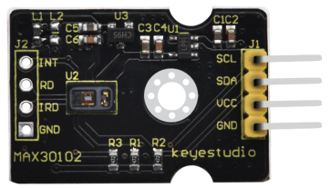
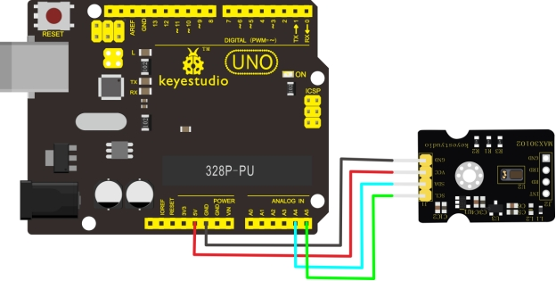
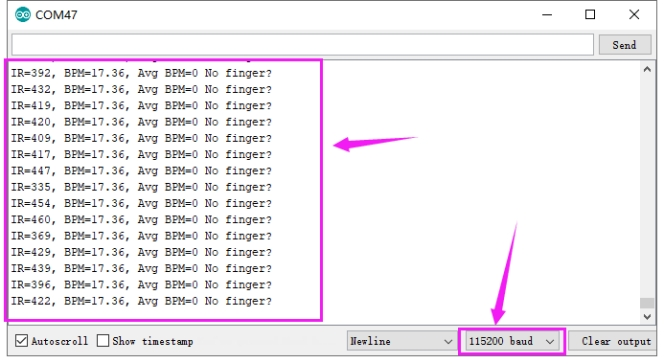
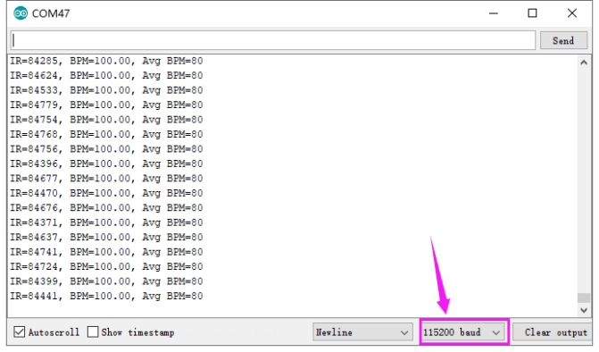

# KS0462 Keyestudio MAX30102 Heart Rate Sensor



## 1. Overview

The Keyestudio MAX30102 heart rate sensor integrates a pulse oximeter and a heart rate monitor, and mainly uses the MAX30102EFD component.

It integrates an infrared LED, photodetector, optical components, and low-noise electronic circuitry with ambient light suppression.

The sensor contains an I2C communication interface. When using it, we use the communication interface to transmit the collected data to the MCU with I2C communication interface, and then calculate the heart rate and blood oxygen.

In order to facilitate the connection of the sensor to other devices, the sensor also comes with a 3mm diameter fixing hole.

## 2. Technical parameters

- Working voltage: DC 5V
- Working current: 60mA
- Maximum power: 0.3W
- Operating temperature range: -25°C to +65°C
- Communication interface: I2C communication (4pin pitch is 2.54mm pin)
- Size: 20 * 36 * 7mm
- Weight: 2.5g
- Environmental attributes: ROHS

## 3. Wiring Diagram



## 4. Test Code

Download Resource: [Resource](./Resource.7z)

```c
#include <Wire.h>
#include "MAX30105.h"
#include "heartRate.h"
MAX30105 particleSensor;
const byte RATE_SIZE = 4; //Increase this for more averaging. 4 is good.
byte rates[RATE_SIZE]; //Array of heart rates
byte rateSpot = 0;
long lastBeat = 0; //Time at which the last beat occurred

float beatsPerMinute;
int beatAvg;

void setup()
{
  Serial.begin(115200);
  Serial.println("Initializing...");

  // Initialize sensor
  if (!particleSensor.begin(Wire, I2C_SPEED_FAST)) //Use default I2C port, 400kHz speed
  {
    Serial.println("MAX30105 was not found. Please check wiring/power. ");
    while (1);
  }
  Serial.println("Place your index finger on the sensor with steady pressure.");

  particleSensor.setup(); //Configure sensor with default settings
  particleSensor.setPulseAmplitudeRed(0x0A); //Turn Red LED to low to indicate sensor is running
  particleSensor.setPulseAmplitudeGreen(0); //Turn off Green LED
}

void loop()
{
  long irValue = particleSensor.getIR();
  if (checkForBeat(irValue) == true)
  {
    //We sensed a beat!
    long delta = millis() - lastBeat;
    lastBeat = millis();
    beatsPerMinute = 60 / (delta / 1000.0);
    if (beatsPerMinute < 255 && beatsPerMinute > 20)
    {
      rates[rateSpot++] = (byte)beatsPerMinute; //Store this reading in the array
      rateSpot %= RATE_SIZE; //Wrap variable

      //Take average of readings
      beatAvg = 0;
      for (byte x = 0 ; x < RATE_SIZE ; x++)
        beatAvg += rates[x];
      beatAvg /= RATE_SIZE;
     }
   }
   Serial.print("IR=");
   Serial.print(irValue);
   Serial.print(", BPM=");
   Serial.print(beatsPerMinute);
   Serial.print(", Avg BPM=");
   Serial.print(beatAvg);
   if (irValue < 50000)
     Serial.print(" No finger?");
   Serial.println();
}
```

## 5. Test Result

According to the wiring diagram, connect the board to computer with a USB cable, upload the test code successfully, then open the serial port monitor, set the baud rate to 115200, and the serial port monitor displays as shown below.



The IR value is a value for judging whether or not the finger is close. When the finger is not close to the sensor, the IR value is small and No finger is displayed. The IR value increases sharply after close to the sensor, and the data to be tested starts to enter the test range value. BMP The value is heart rate and the AVG BMP value is blood oxygen saturation. (Avg BPM) blood oxygen saturation is 75-100, heart rate (BPM) 60-150.

**Special Note:**Before the test, first sense the finger pulse. The finger pulse should be fully fitted to the sensor for about 15 seconds to display the stable data. When the serial monitor has no data display, the finger pulse should be moved to facilitate sensor sensing, or press Reset button on the UNO board until get smoother data.

